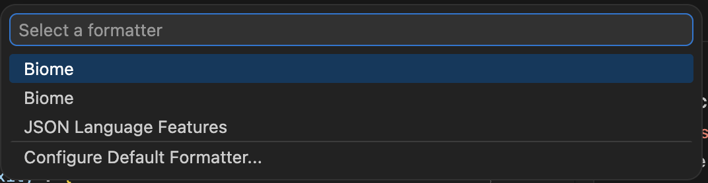

# biome-vscode on multi-root setup

Open `biome-vscode-repro.code-workspace` to test the behavior.

## Project configurations

| Configuration           | //              | sub-projects/proj1   | sub-projects/proj2            |
|-------------------------|-----------------|----------------------|-------------------------------|
| root                    | true            | true                 | false                         |
| extends                 | none            | none                 | //                            |
| format (indent)         | 2 whitespaces   | tab                  | 4 whitespaces                 |
| lint                    | recommended     | complexity           | complexity (+ recommended)    |
| assist                  | organizeImports | (no config)          | disabled                      |
| javascript (quoteStyle) | single          | double               | (no config = single)          |
| javascript (semicolon)  | asNeeded        | (no config = always) | (no config = asNeeded)        |

## Result

- `//`: OK
- `sub-projects/proj1`: not formatted
- `sub-projects/proj2`: OK

For `proj1`, format on save did not work. Maybe a nested configuration with `root: false` is not working correctly. Other than that, looks good to me.

## Edit

nhedger kindly and quickly gave us comment (https://github.com/biomejs/biome-vscode/issues/631#issuecomment-4097317493).

The problem is that there are two Biome LSP per project in this setting. If you select `Format document with`, you'll see two Biomes:

For now, this situation should be avoided. See the linked comment for how to do with this.

