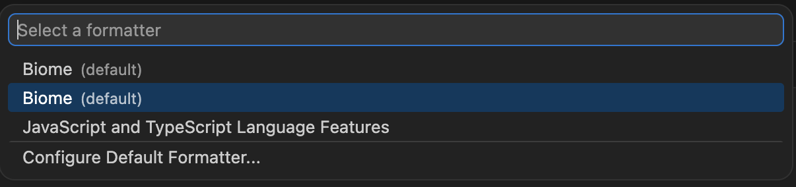

# biome-vscode on multi-root setup

## Project configurations

| Configuration           | //              | proj1                | proj2                         |
|-------------------------|-----------------|----------------------|-------------------------------|
| root                    | true            | true                 | false                         |
| extends                 | none            | none                 | //                            |
| format (indent)         | 2 whitespaces   | tab                  | 4 whitespaces                 |
| lint                    | recommended     | complexity           | complexity (+ recommended)    |
| assist                  | organizeImports | (no config)          | (no config = organizeImports) |
| javascript (quoteStyle) | single          | double               | (no config = single)          |
| javascript (semicolon)  | asNeeded        | (no config = always) | (no config = asNeeded)        |

## Result

- `//`: OK
- `proj1`: not formatted
- `proj2`: OK

For `proj1`, format on save did not work, and there were two `biome` in `Format document with` command:

